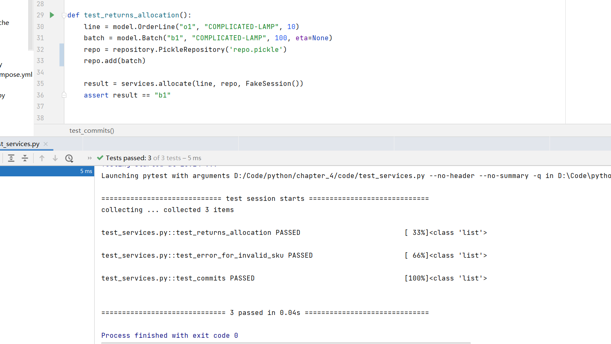

.. ChapterFour documentation master file, created by
   sphinx-quickstart on Mon Jun 13 15:46:54 2022.
   You can adapt this file completely to your liking, but it should at least
   contain the root `toctree` directive.

Lab3:Persistence Ignorance
======================================
小组成员：
'''''''''
201931990526   楼吉诚
^^^^^^^^^^^^^
201931990524   李远帆
^^^^^^^^^^^^^
201931990523   李森特
^^^^^^^^^^^^^
201931990521   康净焮
^^^^^^^^^^^^^
201931990528   潘林鑫
^^^^^^^^^^^^^

Abstract
--------

Understand the Repository Pattern.

Understand the Service Layer Pattern.

Understand why it is important to separate business logic from data storage techniques.

Introduction
------------

In our textbook, we use SQLAlchemy to implement the Repository Pattern by defining a class called
SQLAlchemyRepository in repository.py. This repository implementation depends on a SQLAlchemy
session object and the PostgreSQL database. In this lab, you are going to use a non-database strategy
while implementing the Repository Pattern. More specifically, you will define a repository class called
PickleRepository. As the class name indicates, this class will use a pickle file as the infrastructure. A
pickle file is simpler than a database, isn’t it?

Results
-------

演示视频链接：
^^^^^^^^^^^^^

https://cloud.zjnu.edu.cn/share/e0ee5c5956faf49f4626d504b2

测试通过截图：
^^^^^^^^^^^^^

问题回答：
^^^^^^^^^^^^^

Quz1: What is the difference between the textbook test services.py and my test services.py?

Answer:  旧的services.py使用SqlAlchemy将数据存入session中再与PostgreSQL进行数据交互，新的services.py使用pickle调用定义方法将数据转换为二进制格式存储到.pickle文件中

Quz2: Has the service layer been affected after we have chosen to use another implementation for the Repository Pattern? Can we say that the service layer is ignorant of the persistence?

Answer:  对业务层逻辑没有影响。不能，业务逻辑层会调用数据持久层的逻辑来访问数据库，在本次实验中即使将原本对数据库的操作改为pickle，实际上仍然是对数据的操作

Quz3:  What is the benefit of separating business logic from infrastructure concerns? Where is the business logic defined, and where is the infrastructure defined? Tell me the Python file name(s).

Answer:  在更改其他的层级代码时不需要对业务逻辑进行改动，提高了软件的可维护性与安全性，同时由于耦合度的降低，使得代码的重用率更高。  业务逻辑：service.py  基础结构：orm.py

End
~~~
